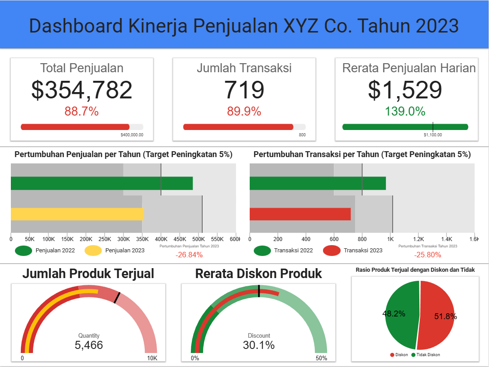

# Dashboard-Penjualan-2023

## Dashboard Screenshot



## Dashboard Link

🔗 [Klik di sini untuk melihat dashboard Looker Studio](https://lookerstudio.google.com/u/0/reporting/065591b7-b16c-479f-b587-84993105dc2c/page/dWsKF)

---
## SQL Explanation

Seluruh data diperoleh dari data warehouse dengan tabel utama `fact_sales` dan dimensi waktu `dim_time`. Beberapa query umum yang digunakan:

```sql
-- Total penjualan tahunan
SELECT SUM(Sales)
FROM fact_sales fs
JOIN dim_time dt ON fs.order_date = dt.order_date
WHERE dt.year = '2023';

-- Jumlah transaksi tahunan
SELECT COUNT(DISTINCT fs.Order_ID)
FROM fact_sales fs
JOIN dim_time dt ON fs.order_date = dt.order_date
WHERE dt.year = '2023';

-- Jumlah produk terjual
SELECT SUM(fs.Quantity)
FROM fact_sales fs
JOIN dim_time dt ON fs.order_date = dt.order_date
WHERE dt.year = '2023';

-- Rerata diskon produk
SELECT AVG(fs.Discount)
FROM fact_sales fs
JOIN dim_time dt ON fs.order_date = dt.order_date
WHERE fs.Discount > 0 AND dt.year = '2023';

-- Rerata penjualan harian
SELECT SUM(fs.Sales)/COUNT(DISTINCT fs.order_date)
FROM fact_sales fs
JOIN dim_time dt ON fs.order_date = dt.order_date
WHERE dt.year = '2023';

-- Rasio produk tanpa diskon
SELECT 
  COUNT(CASE WHEN fs.Discount = 0 THEN 1 END) * 1.0 / COUNT(fs.Discount)
FROM fact_sales fs
JOIN dim_time dt ON fs.order_date = dt.order_date
WHERE dt.year = '2023';
```

## Penjelasan Dashboard

| No | Goals | KPI | Perhitungan | Visualisasi | Target | Actual | Status |
|----|-------|-----|-------------|--------------|--------|--------|--------|
| 1 | Meningkatkan total pendapatan penjualan tahunan agar mencapai ≥ $400,000 | Total Penjualan Tahunan | SUM(Sales) WHERE year = '2023' | Text Chart (Score Card) | ≥ $400,000 | $354,782 | ❌ Tidak Tercapai |
| 2 | Meningkatkan jumlah transaksi penjualan ≥ 800 transaksi per tahun | Jumlah Transaksi Tahunan | COUNT(DISTINCT Order_ID) WHERE year = '2023' | Score Card | ≥ 800 | 719 | ❌ Tidak Tercapai |
| 3 | Pertumbuhan total penjualan sebesar 5% per tahun | Pertumbuhan Penjualan | ((Sales_2023 - Sales_2022)/Sales_2022) | Bullet Chart | +5% | -26.84% | ❌ Tidak Tercapai |
| 4 | Pertumbuhan jumlah transaksi 5% per tahun | Pertumbuhan Transaksi | ((Count_Order_2023 - Count_Order_2022)/Count_Order_2022) | Bullet Chart | +5% | -25.80% | ❌ Tidak Tercapai |
| 5 | Jumlah produk terjual ≥ 6.500 unit | Jumlah Produk Terjual | SUM(Quantity) WHERE year = '2023' | Gauge Chart | ≥ 6,500 | 5,466 | ❌ Tidak Tercapai |
| 6 | Rerata diskon produk ≤ 25% | Rerata Diskon | AVG(Discount) WHERE Discount > 0 AND year = '2023' | Gauge Chart | ≤ 25% | 30.1% | ❌ Tidak Tercapai |
| 7 | Rerata penjualan harian ≥ $1,100 | Rata-rata Penjualan Harian | SUM(Sales)/COUNT(DISTINCT Order_Date) | Score Card | ≥ $1,100 | $1,529 | ✅ Tercapai |
| 8 | ≥ 65% produk terjual tanpa diskon | Rasio Produk Tanpa Diskon | COUNT(Discount = 0) / COUNT(Discount > 0) | Pie Chart | ≥ 65% | 48.2% | ❌ Tidak Tercapai |

---

## Analisis KPI Berdasarkan Dashboard

### 1. Total Penjualan
**❌ Tidak Tercapai** — Total penjualan 2023 hanya mencapai $354,782 (88.7% dari target). Perlu peningkatan pemasaran/promosi.

### 2. Jumlah Transaksi
**❌ Tidak Tercapai** — Jumlah transaksi hanya 719 (89.9% dari target). Perlu strategi promosi lebih agresif.

### 3. Pertumbuhan Penjualan 5%
**❌ Tidak Tercapai** — Penurunan 26.84% dibanding tahun 2022. Penjualan 2023 hanya $354,000 dari $484,900 sebelumnya.

### 4. Pertumbuhan Transaksi 5%
**❌ Tidak Tercapai** — Penurunan 25.80% dibanding tahun 2022 (969 → 719 transaksi).

### 5. Jumlah Produk Terjual
**❌ Tidak Tercapai** — Total hanya 5.466 unit dari target 6.500 unit. Disarankan perluasan variasi produk.

### 6. Rerata Diskon Produk
**❌ Tidak Tercapai** — Rerata diskon 30.1%, melebihi batas aman 25%. Berisiko mengurangi margin keuntungan.

### 7. Rerata Penjualan Harian
**✅ Tercapai** — Rata-rata penjualan harian sebesar $1,529 (melebihi target $1,100). Ini menunjukkan efisiensi operasional dalam 232 hari kerja.

### 8. Rasio Produk Tanpa Diskon
**❌ Tidak Tercapai** — Produk tanpa diskon hanya terjual sebanyak 48.2% dari total produk yang terjual. Disarankan menjaga proporsi produk tanpa diskon untuk efisiensi margin.